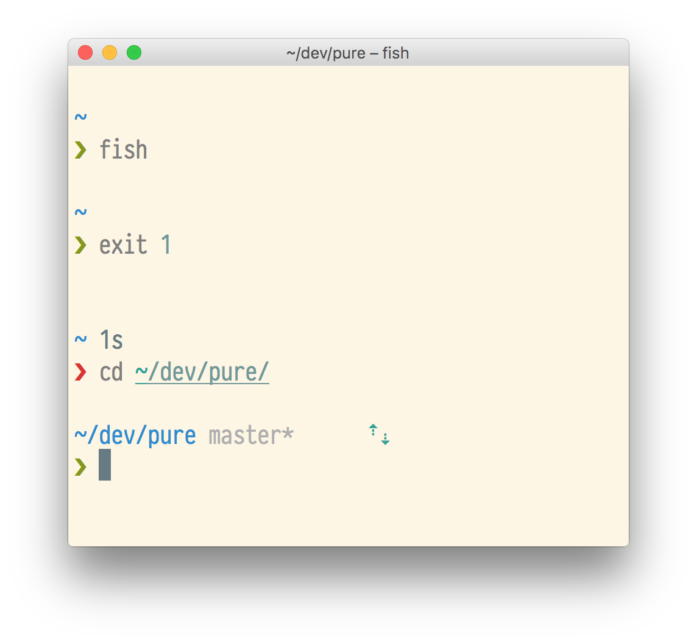

# Pure

> Port of the [`pure`](https://github.com/sindresorhus/pure) ZSH theme to Fish

# Todo

- [x] Display current directory tail
- [x] Display Git branch name
- [x] Display whether or not the working copy is dirty
- [x] Display an up arrow if there are stuff to be pushed
- [x] Display an down arrow if there are stuff to be pulled
- [ ] Prompt symbol should be red if previous command failed
- [x] Display the current path in the title (show full path on title)
- [ ] Display current job and command in the title
- [ ] Display the current folder and command when a process is running
- [ ] Display username and host when in an SSH session
- [x] Add colors
- [x] Format newline
