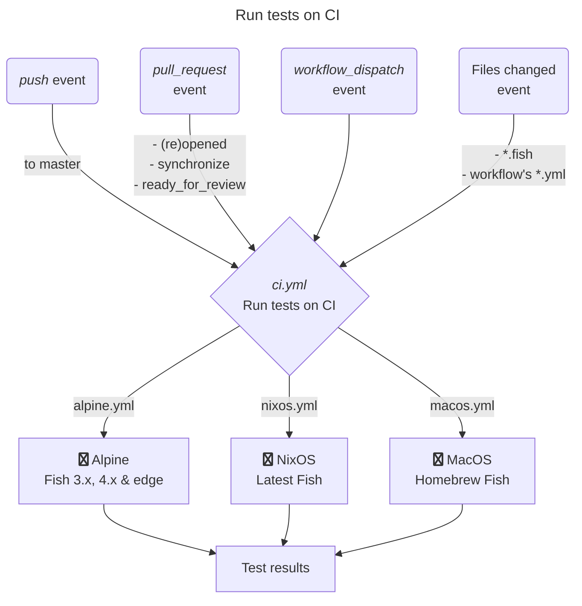
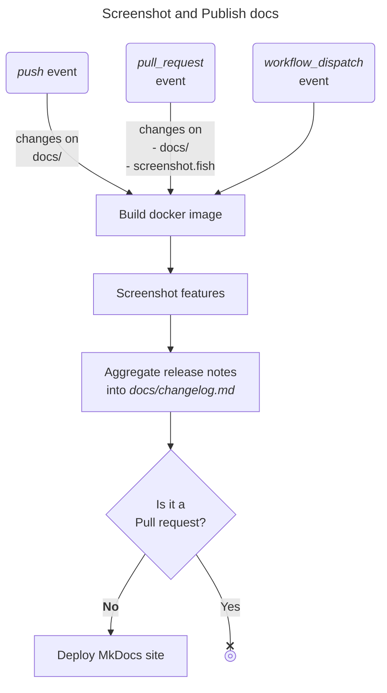
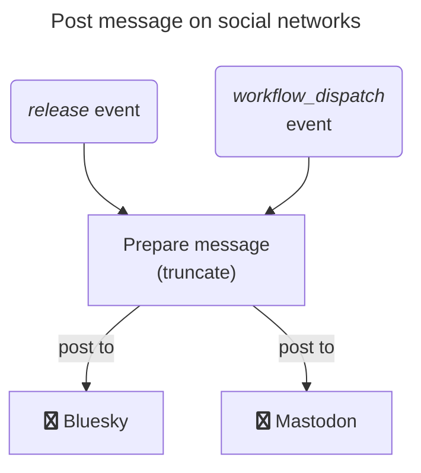
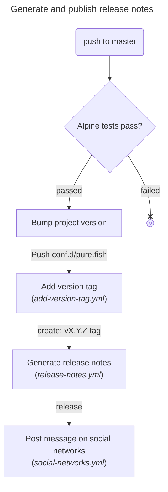

<!-- markdownlint-disable MD041 -->
## Releasing

Release process is automated in the pipeline with the following steps.

!!! info

    We follow [semver](https://semver.org/), release is manage in the pipeline

### Posting on social media

There is a [workflow][social] to post on social media that is triggered when a new release is published.

### Test

We run the test workflow on:

* Pull Request changing
  * any `**.fish` ;
  * and workflow (`*.yml`) files ;
* on `master` branch changing
  * `**.fish` files with the exception `conf.d/pure.fish`, as we have dedicated mechanism to manage versions bump ;
  * and workflow (`*.yml`) files

### CI jobs

The workflows contain these jobs:

* **Alpine tests:** build and test Pure with Fish 3.3.1, 3.7.1, 4.0.2, 4.2.1, and `edge`.
* **NixOS tests:** build and test Pure with the latest Fish release.
* **macOS tests:** install Fish with Homebrew and run the FishTape suite.
* **Version bump:** after Alpine tests pass on `master`, compute and push the next version when needed.
* **Tag creation:** when `conf.d/pure.fish` changes on `master`, create a `vX.Y.Z` tag from `$pure_version`.
* **Release creation:** when a version tag is created, generate notes and publish a GitHub Release.
* **Documentation:** build screenshots, update `docs/changelog.md` from GitHub Releases, and publish the MkDocs site. Pull requests run the build without deployment.
* **Social posting:** when a release is published, post its summary to Bluesky and Mastodon.

### Versioning

!!! success

    Commit messages must **[follow conventional commits convention][coco]**.

Versioning is done automatically based on commit messages and triggered only on `master` branch.

Details:

1. We compute the [project's next version][next-version] using a GitHub Action ;
2. Then update `$pure_version` value in `./conf.d/pure.fish` ;
3. Finally commit and [push the change][push] to the repo.

!!! info

    We have a git hook to append branch name to version on branch checkout. You need to enable githooks in your local repo with 

    ```
    git config core.hooksPath .githooks/
    ```

### Adding new tag

The `add-version-tag.yml` pipeline is triggered only for `master` when `./conf.d/pure.fish` is changed and add a tagged based on `$pure_version`.

### Workflows


#### Tests execution

see: [.github/workflows/ci.yml](.github/workflows/ci.yml)



#### Documentation generation

see: [.github/workflows/doc.yml](.github/workflows/doc.yml)



#### Posting to social networks

see: [.github/workflows/social-networks.yml](.github/workflows/social-networks.yml)



#### New release

see: [.github/workflows/release-notes.yml](.github/workflows/release-notes.yml)



[next-version]: https://github.com/thenativeweb/get-next-version
[push]: https://github.com/ad-m/github-push-action
<!-- markdownlint-disable-next-line MD053 -->
[coco]: https://www.conventionalcommits.org/en/v1.0.0/
[social]: https://github.com/pure-fish/pure/blob/master/.github/workflows/social-networks.yml
